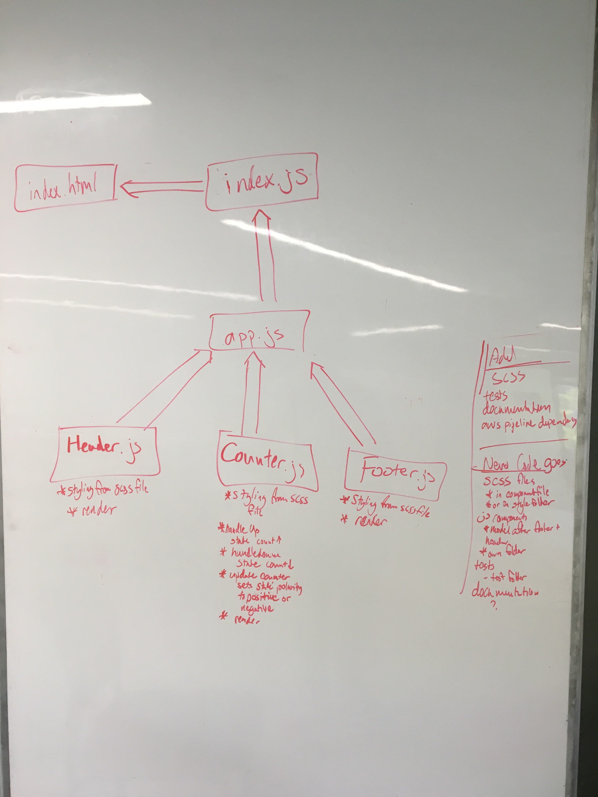

 LAB 27
=================================================

## React Testing and Deploymen

### Author: Aaron Ferris

### Links and Resources
* [repo](http://xyz.com)
* [travis](http://xyz.com)
* [AWS DEPLOYMENT](http://lab27af.s3-website-us-west-2.amazonaws.com/)
* [NETLIFY DEPLOYMENT](https://sad-mahavira-ab9b77.netlify.com/)
* [AWS PIPELINE DEPLOYMENT](d3tv5u6090a9s.cloudfront.net)
)

#### Documentation

Can be found by 

#### Tests
[x] Counter   
     [x] will run with stable dom (xit for travis build)  
[x] For Up event  
     [x] Assert state changes properly  
     [x] Assert that state is being transferred to the DOM  
[x] For Down event  
     [x] Assert state changes properly  
     [x] Assert that state is being transferred to the DOM  

#### UML
  
Drawn with chris and cory
